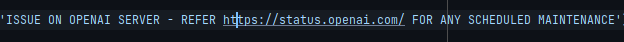

## API Documentation
### Keyword Endpoint :  `/prediction`
#### Type : `POST`

| Input Parameter  | Type | Constraints           |
|------------------|------|-----------------------|
| Text             | str  | No                    |
| Model            | str  | No                    |

* **Curl command**

    	

* **Return** 

    Returns output as JSON object with timestamp
    
    

* **Error Codes**

    **500 - Prediction Module Error :** when error occurs inside the module

    

    **404 - Invalid model name**
    
    

### Hashtag Endpoint :  `/prediction`
#### Type : `POST`

| Input Parameter  | Type | Constraints           |
|------------------|------|-----------------------|
| Text             | str  | No                    |
| Model            | str  | No                    |

* **Curl command**

    	

* **Return** 

    Returns output as JSON object with timestamp and token usage info. 
    
    

* **Error Codes**

    **500 - Prediction Module Error :** when error occurs inside the module
    
    ****

    **503 - Maintenance/Outage in OPENAI server**
    
    **401 – API Key is Invalid, Expired or Revoked**

    	
  
    **429 - Rate limit reached** - When maximum api calls per minute reached

  **404 - Invalid model name**
    
    

### Topic Endpoint :  `/prediction`
#### Type : `POST`

| Input Parameter  | Type | Constraints           |
|------------------|------|-----------------------|
| Text             | str  | No                    |
| Model            | str  | No                    |

* **Curl command**

    

* **Return** 

    Returns output as JSON object with timestamp
    
    

* **Error Codes**

    **500 - Prediction Module Error :** when error occurs inside the module
    
    

    **404 - Invalid model name**
    
    

### Zeroshot Endpoint :  `/prediction`
#### Type : `POST`

| Input Parameter   | Type | Constraints           |
|-------------------|------|-----------------------|
| Text              | str  | No                    |
| Labels (Optional) | list | Min 2 - Max 20 items  |
| Model             | str  | No                    |

* **Curl command**	

    

* **Return** 
    
    Returns output as JSON object with timestamp
    
    	

* **Error Codes**
    
    **500 - Prediction Module Error :** when error occurs inside the  module
    
    
    
    **404 - Invalid model name**
    
    
    

**::: END :::**
