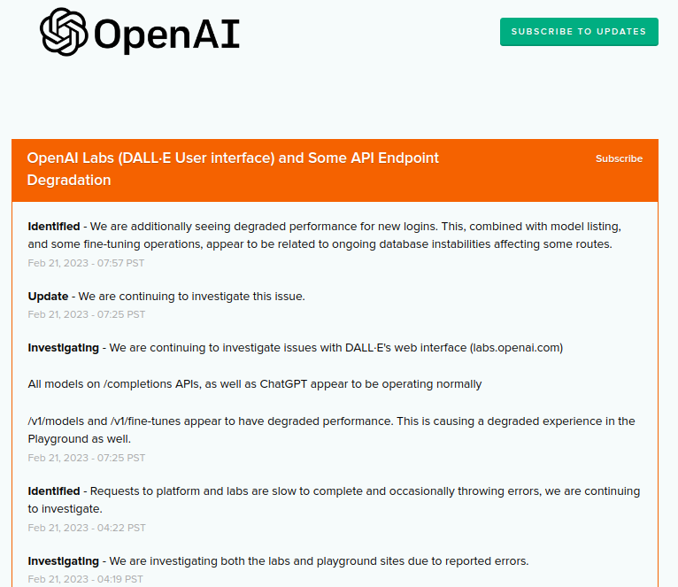

### Deployment Documentation

### GitHub Repo

   Initial step - clone the repository 
   
   `sudo apt update`
   
   `sudo apt install git`
   
   `git clone <repo link>`
   
   **# sample link**
   
   
   
   To add ssh access in a new server to clone private repo
   
   `ssh-keygen -t ed25519 -C "example@gmail.com"` 	
   
   `eval "$(ssh-agent -s)"`	 	 		
   
   `ssh-add ~/.ssh/id\_ed25519`	 	 	 	
   
   `cat ~/.ssh/id\_ed25519.pub`
   
   Copy this public key and paste it in **SSH and GPG keys**  section in your Github profile
   
   

### Install Dependencies
   
   `sudo apt update`
   
   `sudo apt install python3-pip`	
   
   `sudo apt install uvicorn`
   
   `pip3 install -r requirements.txt`	 

* For NVIDIA GPU enabled servers install this additionally

   `sudo apt install nvidia-driver-525 nvidia-dkms-525`

   `sudo apt install nvidia-kernel-common-525`

* NVIDIA TOOLKIT for docker

   `curl https://get.docker.com | sh \
   && sudo systemctl --now enable docker`

   `sudo apt-get install -y nvidia-container-toolkit`

   `sudo nvidia-ctk runtime configure --runtime=docker`

   `sudo systemctl restart docker`

### Execution
* #### Generating API key for hashtag module
 
Go to <https://openai.com/api/>  and create a free account using email. 
Go to Account -> View API keys

Click on - Create a new secret key

Copy the key - This key will be displayed only once, so save it in a secure location.

Pricing - <https://openai.com/api/pricing/>

Detailed documentation - <https://platform.openai.com/docs/introduction>

Scheduled Maintanence - We recommend to subscribe the OPENAI status page for maintenance/outage notification- https://status.openai.com/

* #### Setting up environment variable
 
Create .env file in the same directory, specify the following variables 

**Hash Module**

   **<API\_KEY>** - secret key generated from openai
   
   egs :   
   
   **API\_KEY = “XXXXXXXXXXX\_APIKEY\_FROM\_OPENAI”     (within quotes)**

* #### Config file

Each module has its own **config\_xxx.ini** file to store parameter values. Changing the values will reflect in module execution.

* #### Download necessary files

Download required files from google drive place it in the folder named - **<files>** in the same directory. You can download these and put it in your Network storage and then attach it as a volume in your docker. These will be required during run time.

Topic module - [**automl**](https://drive.google.com/drive/folders/1ye1F4JKASw2OAhYzXtl6Wo4CErLavcLI?usp=sharing)

Keyword module  - **[files](https://drive.google.com/drive/folders/15StouS_kQv7dIAr8NPBd0B2ZQQzd0lWZ?usp=sharing)** 

Zeroshot module - **[files](https://drive.google.com/drive/folders/1A1DBl9zGvQrZgMocQuNfxoQ09AcVZ3uD?usp=sharing)** 

For redundancy, we put the same files in other location as well. If the above link is not working, please download it fromthe below location:

**Location1**

Topic module - [**automl**](https://drive.google.com/drive/folders/1OEnvC24vnPscO5zFPKgVMp7NxSN12IZT?usp=sharing)

Keyword module  - **[files](https://drive.google.com/drive/folders/1jLyfpLg6UeHPU_BaY08SahLvWQKKO4nA?usp=sharing)** 

Zeroshot module - **[files](https://drive.google.com/drive/folders/10RXuDWBPULETUAg8xpqzcu-faTRJJPUg?usp=sharing)** 

**I strongly recommend to keep a copy of it with you.**

* #### Server Startup

Run **xxxx\_fastapi.py** file and access the endpoint in [http://127.0.0.1:8001/](http://127.0.0.1:8000/)prediction

`uvicorn <xxxx\_fastapi file\_without\_py\_extension>:app --port 8001 --host 0.0.0.0 --reload`

* #### Client Script

You can also access the endpoints using the client script. Run **client\_xxx** prefix file to automate the endpoint access. You can do bulk prediction by feeding the .csv file to the client script. CSV file should have only one column named ‘text’ containing the text for prediction.

`Python3 <client\_xxxxx.py>`

### Dockerize

* #### Installation

Install the docker using the following commands in linux operating system

`sudo apt update -qq`

`sudo apt install apt-transport-https ca-certificates curl software-properties-common -qq`

`curl -fsSL https://download.docker.com/linux/ubuntu/gpg | sudo apt-key add -`

`sudo add-apt-repository "deb [arch=amd64] https://download.docker.com/linux/ubuntu bionic stable"`

`sudo apt update -qq`

`sudo apt install docker-ce`

* #### Dockerfile

File specifies how the image has to be created and run on execution.

**FROM** - base image to run our module

**COPY** - working  directory source path in local system

**RUN** - run requirements.txt file to install all dependent packages

**EXPOSE** - port for app to run

**WORDIR** - working directory path inside docker image

**CMD** - command to run the application after starting the container

* #### Building docker image

Build the docker images as specified in Dockerfile

`sudo docker build -t <image\_name>:<version\_tag>  <source\_directory>`	

for egs:  `sudo docker build -t zero:1.0 .`

* #### Running docker container

Run docker using below command

`sudo docker run -p <port>:<port> :<version\_tag>`	 	 	

for egs:  `sudo docker run -p 8001:8001 zero:1.0`	

gpu enabled container:

`sudo docker run --rm -p 8001:8001 --gpus all -d zeroshot:1.0`

### Deploying in AWS

Choose the apt configuration available in EC2 instances and transfer the file from local machine via SCP

You can either transfer model files or clone directly from huggingface site and build the docker image in EC2 instance. We need to open a custom TCP port 8000 and 8001 in security settings to allow access through that channel. After enabling, type the following command in case you face any issue in accessing the ports. 

`sudo ufw allow 8001/tcp`

* #### To transfer files from local system to AWS instance

`scp -i <private key.pem>   <localpath\_tocopy>  username@ec2address:<destination\_path>`

Egs:  	 	 	 	

`scp -i <token.pem>   <source file location> <ubuntu@ec2-xx-xx-xx-xx.ap-south-1.compute.amazonaws.com>:<destination path>`

* #### Create an instance with linux image

Choose preferred configuration depending on the module requirements**

You can open the ports in **Security -> select your security group** and add the additional ports under **Custom/TCP**

Once the port is enabled, run the docker and access the endpoints using the below link 

`http://<EC2_instance_public_ip>:8001/<endpoints>`

**END**

